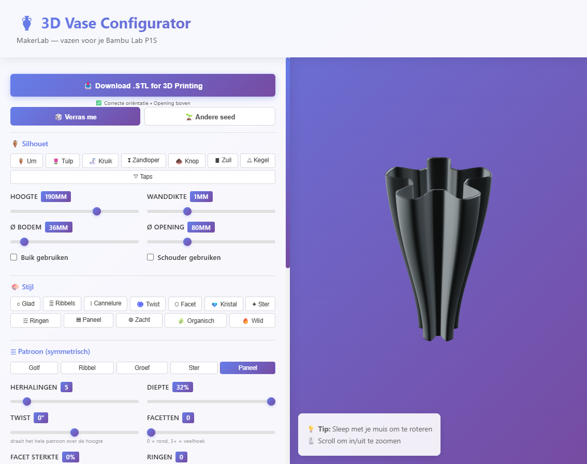
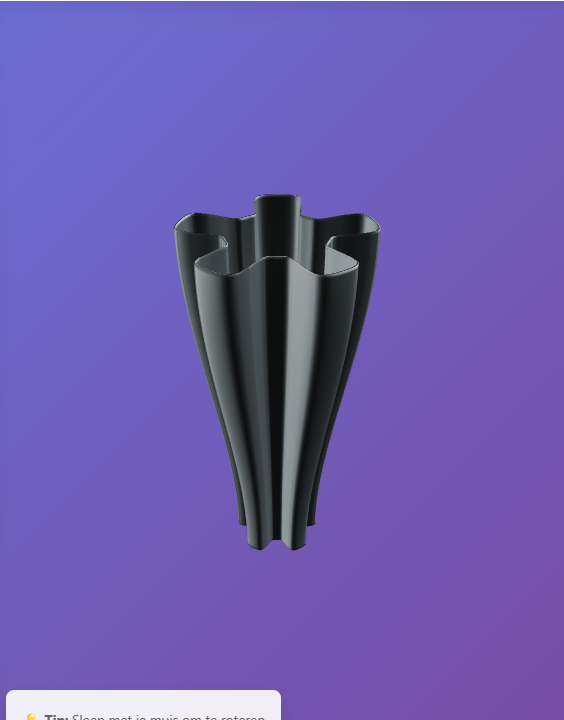

# Easy 3D Printer Vase Configurator

<p align="center">
  
  
  
  
</p>

A premium browser-based tool for designing custom 3D-printable vase shapes. Fine-tune the silhouette, create decorative surface patterns, adjust printability settings, and export a ready-to-print STL in a few clicks.

<div align="center">
  
</div>

## Overview

This project turns vase design into a fast visual workflow. Instead of modeling by hand in CAD software, you can iterate on proportions, twist, pattern, and print stability directly in the browser and export the final result for your 3D printer.

## Key features

- Real-time 3D visualization while you edit the model
- Adjustable silhouette with height, base, top opening, shoulders, and belly controls
- Decorative pattern options including ribs, grooves, rings, waves, facets, and twist styling
- Organic form controls for more natural, sculptural vase profiles
- Printability-aware settings to reduce steep overhangs and improve successful prints
- Direct STL export with no backend required

## Gallery

<div align="center">
  
  <br /><br />
  
</div>

## Why it is useful

This project is designed for makers who want quick iteration without the friction of traditional CAD workflows. It is especially helpful for:

- decorative home objects
- custom gifts and one-off pieces
- small maker-lab explorations
- fast concepting of printable vase forms

## Tech stack

- React 18
- Vite
- Three.js
- @react-three/fiber
- @react-three/drei

## Getting started

### 1) Clone the repository

```bash
git clone https://github.com/bo-wux/easy-3d-printer-vase-configurator.git
cd easy-3d-printer-vase-configurator
```

### 2) Install dependencies

```bash
npm install
```

### 3) Run locally

```bash
npm run dev
```

Then open:

```text
http://localhost:3000
```

### 4) Build for production

```bash
npm run build
```

The optimized build output is generated in the `dist` folder.

## How it works

The configurator generates a parametric vase profile and then applies patterning, organic deformation, and printability rules before exporting the final geometry. This makes it easy to test different aesthetic directions while keeping the object suitable for practical 3D printing.

## Project structure

```text
src/
├── components/
│   ├── ExportButton.jsx
│   ├── PrintPreview.jsx
│   ├── VaseConfigurator.jsx
│   ├── VaseControls.jsx
│   └── VaseViewer.jsx
├── lib/
│   └── vaseShape.js
├── index.css
├── main.jsx
├── App.jsx
└── ...
```

## License

This project is open source and intended for maker and 3D-print workflows.

## Credits

Built for visual, fast, and flexible custom vase design.
